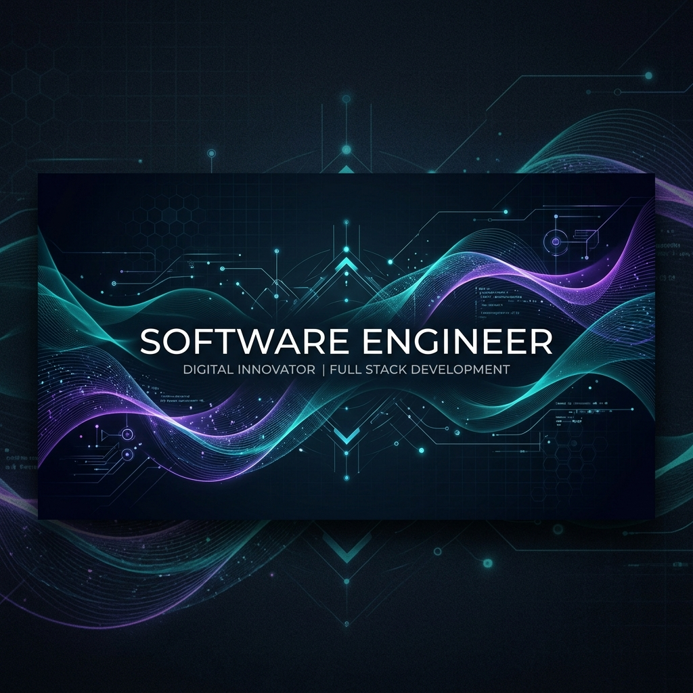

<!-- Banner -->

  

<!-- Animated Typing Header -->

  

<h3 align="center">Passionate Developer | Desktop Applications & Hardware Integrations</h3>

---

### 💫 About Me
Hello! I am a **Software Engineer** specializing in desktop application development and hardware-software communication. I enjoy building efficient, reliable, and user-friendly software that interfaces with hardware devices.

- 🔭 **Current Project:** Building smart desktop solutions for ID/driver license scanning with WPF, C#, and serial communication protocols.
- 🌱 **Learning & Researching:** Advanced IoT architectures, embedded systems, and system optimization.
- 💬 **Ask me about:** C#, .NET development, WPF layout/styling, Serial Port (RS232/RS485), and database integration.
- ✉️ **How to reach me:** [nthun1325@gmail.com](mailto:nthun1325@gmail.com)

---

### 🛠️ Tech Stack & Tools

  

---

### 📊 GitHub Statistics

  
  

  

---

  <i>"Simplicity is the soul of efficiency."</i> 
  

